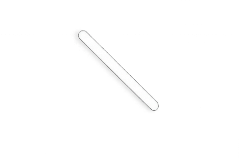

# 🎯 Hangman Game

A simple and interactive desktop Hangman game built with Python. The game features a dark-themed graphical user interface, progressive hangman artwork, an Education-themed word list, and replay support.

## 📌 Overview

This project is a Python-based Hangman game developed using **Tkinter**, **CustomTkinter**, and **Pillow**.

Players have **6 chances** to guess a hidden word one letter at a time. Each incorrect guess progressively reveals another part of the hangman figure.

The current version uses an **Education-themed** word category containing words related to teaching, training, tutoring, preparation, development, and similar concepts.

## ✨ Features

- 🖥️ Desktop graphical user interface
- 🌙 Dark-themed interface
- 🎓 Education-themed word category
- ❤️ 6 chances per round
- 🧩 Progressive hangman drawing
- 🔤 One-letter input validation
- 🚫 Prevents repeated letter guesses
- ⌨️ Press **Enter** to submit a guess
- 🔄 Replay button after winning or losing
- 📱 Dynamic font sizing based on screen width
- 🖼️ Custom hangman artwork using PNG assets

## 🛠️ Technologies Used

- **Python** – Core programming language
- **Tkinter** – GUI and canvas components
- **CustomTkinter** – Modern input and button widgets
- **Pillow (PIL)** – Image loading and resizing

## 📷 Screenshots

### Gameplay Screens

Add screenshots of the running application here. These should show the main game interface, different hangman stages, the winning screen, and the losing/replay state.

Example:

```markdown

```

### Game Artwork

The project includes individual PNG assets that are combined to create the progressive Hangman drawing.





## 📋 Requirements

Python **3.x** is required.

Install the required external libraries using:

```bash
pip install -r requirements.txt
```

The current `requirements.txt` contains:

```text
customtkinter
Pillow
```

> **Note:** `tkinter` is part of the standard Python installation on Windows and normally does not need to be installed separately with `pip`.

## 🚀 Installation

### 1. Clone the repository

```bash
git clone https://github.com/Yash-Agrawal-2004/Hangman-game.git
```

### 2. Navigate to the project directory

```bash
cd Hangman-game
```

### 3. Install the dependencies

```bash
pip install -r requirements.txt
```

### 4. Run the game

```bash
python "hangman game.py"
```

> Keep the PNG artwork files in the same project directory as the Python file, because the game loads the assets by filename.

## 🎮 How to Play

1. Launch the game.
2. Read the hint shown at the top of the window.
3. Enter one alphabetic character into the input field.
4. Click **Guess** or press **Enter**.
5. Correct guesses reveal the corresponding letters in the hidden word.
6. Incorrect guesses reduce the number of remaining chances.
7. Every incorrect guess progressively reveals another part of the hangman.
8. Guess the complete word before all 6 chances are used.
9. After the round ends, click **Replay** to start a new game.

## 📏 Game Rules

- Only **one alphabetic character** can be entered at a time.
- Previously guessed letters cannot be guessed again.
- Every incorrect guess removes **one chance**.
- Each round starts with **6 chances**.
- Correct guesses reveal all matching occurrences of that letter.
- The player wins when every letter in the word has been revealed.
- The player loses when all 6 chances are used.
- After a loss, the correct word is displayed.
- After a win or loss, the **Guess** button becomes **Replay**.

## 🧠 Game Logic

The game randomly selects a word from the predefined Education-themed word list.

During each round, the program keeps track of:

- The selected word
- Previously guessed letters
- Remaining chances
- The letters currently revealed to the player
- The visible stages of the hangman artwork

For every valid guess:

1. The input is converted to lowercase.
2. The program checks that exactly one alphabetic character was entered.
3. The program checks whether the letter has already been guessed.
4. If the letter is present in the word, the matching positions are revealed.
5. If the letter is not present, one chance is removed and the next hangman component is displayed.
6. The game checks for a win or loss condition.
7. The interface is updated accordingly.

## 🎓 Current Word Category

The current version focuses on the **Education** category.

The word list contains terms related to areas such as:

- Schooling
- Teaching
- Training
- Tutoring
- Tuition
- Development
- Preparation
- Instruction
- Education
- Information
- Learning

## ⌨️ Controls

| Control | Action |
|---|---|
| Alphabetic input | Enter a letter |
| **Guess** button | Submit the current guess |
| **Enter** key | Submit the current guess |
| **Replay** button | Start a new round |
| **Esc** key | Restore the window from the zoomed state |

## 📁 Project Structure

```text
Hangman-game/
│
├── hangman game.py      # Main Python game source code
│
├── hangman0.png         # Gallows artwork
├── hangman1.png         # Head artwork
├── hangman11.png        # Additional head detail
├── hangman2.png         # Body artwork
├── hangman3.png         # Right arm artwork
├── hangman4.png         # Left arm artwork
├── hangman5.png         # Left leg artwork
├── hangman6.png         # Right leg artwork
│
├── requirements.txt     # Python dependencies
├── README.md            # Project documentation
└── LICENSE              # Project license
```

## 🔮 Future Improvements

Planned or possible improvements for future versions include:

- 🎯 Multiple word categories
- 🎚️ Difficulty levels
- 📚 Larger word databases
- 🏆 Score and high-score tracking
- 🔢 Round statistics
- ⌨️ On-screen virtual keyboard
- 🔊 Sound effects
- 🎵 Background music
- 🎬 Animated hangman transitions
- 🏠 Start menu
- ⚙️ Settings menu
- 💾 Persistent game statistics
- 🖥️ Improved responsive layouts
- 📦 Standalone executable packaging
- 🛡️ Better error handling for missing assets

## 🤝 Contributing

Contributions, suggestions, and improvements are welcome.

### Contribution workflow

1. Fork the repository.
2. Create a new branch for your changes.

```bash
git checkout -b feature/your-feature-name
```

3. Make your changes.
4. Test the game locally.
5. Commit your changes.

```bash
git add .
git commit -m "Add your change"
```

6. Push your branch.

```bash
git push origin feature/your-feature-name
```

7. Open a Pull Request.

## 🧪 Testing

Before submitting changes, verify that:

- The game starts successfully.
- All PNG artwork files load correctly.
- A valid single-letter guess is accepted.
- Invalid input is rejected.
- Repeated letters are rejected.
- Correct guesses reveal the appropriate letters.
- Incorrect guesses reduce the remaining chances.
- The player can win a round.
- The player can lose a round.
- The **Replay** button starts a fresh game.
- The **Enter** key submits a guess.

## 📦 Dependencies

The project currently depends on:

| Package | Purpose |
|---|---|
| `customtkinter` | Modern Tkinter widgets and controls |
| `Pillow` | Image loading and resizing |

Python's built-in modules used by the project include `tkinter` and `random`.

## 📄 License

This project is licensed under the **MIT License**.

See the [`LICENSE`](LICENSE) file for the complete license text.

## 👨‍💻 Author

**Yash Agrawal**

GitHub: [@Yash-Agrawal-2004](https://github.com/Yash-Agrawal-2004)

Repository: [Hangman-game](https://github.com/Yash-Agrawal-2004/Hangman-game)

## ⭐ Support

If you found this project useful or interesting, consider giving the repository a ⭐ on GitHub.

---

Made with ❤️ using Python.
